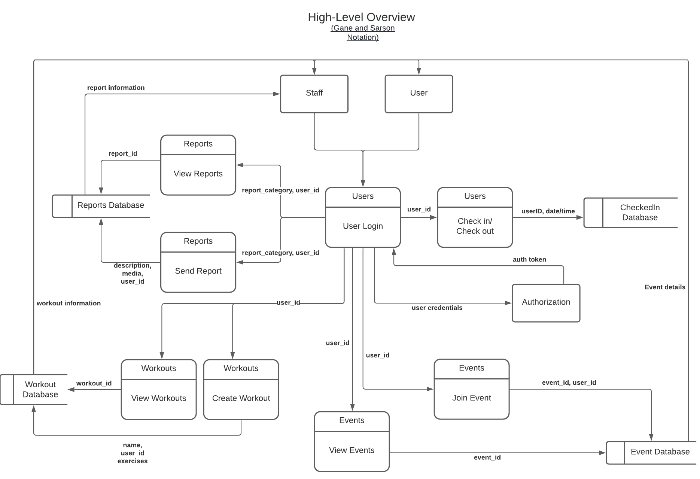
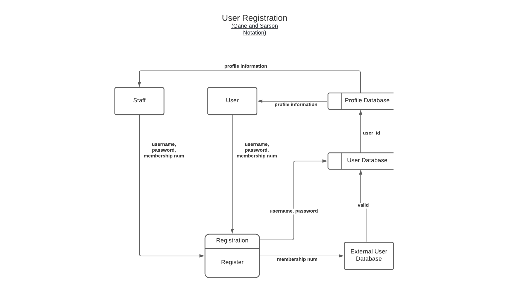
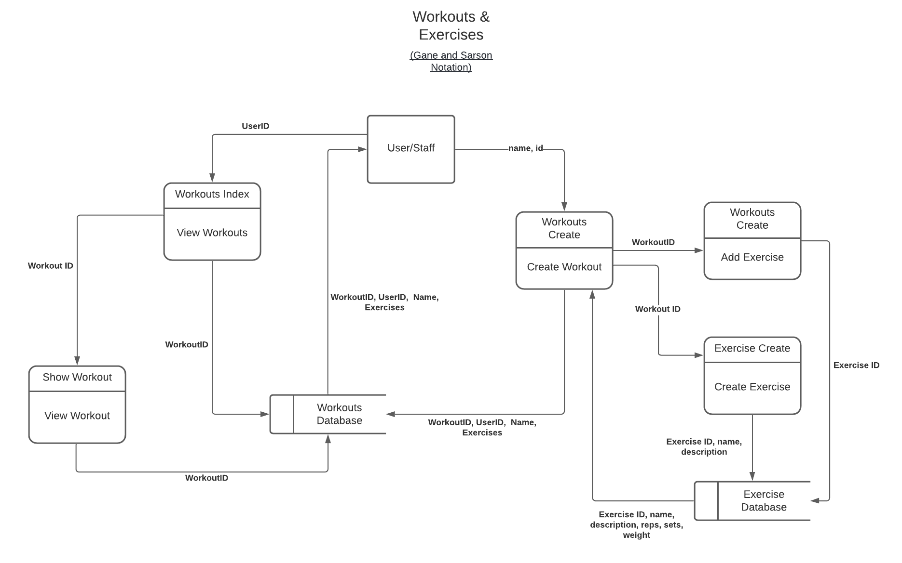
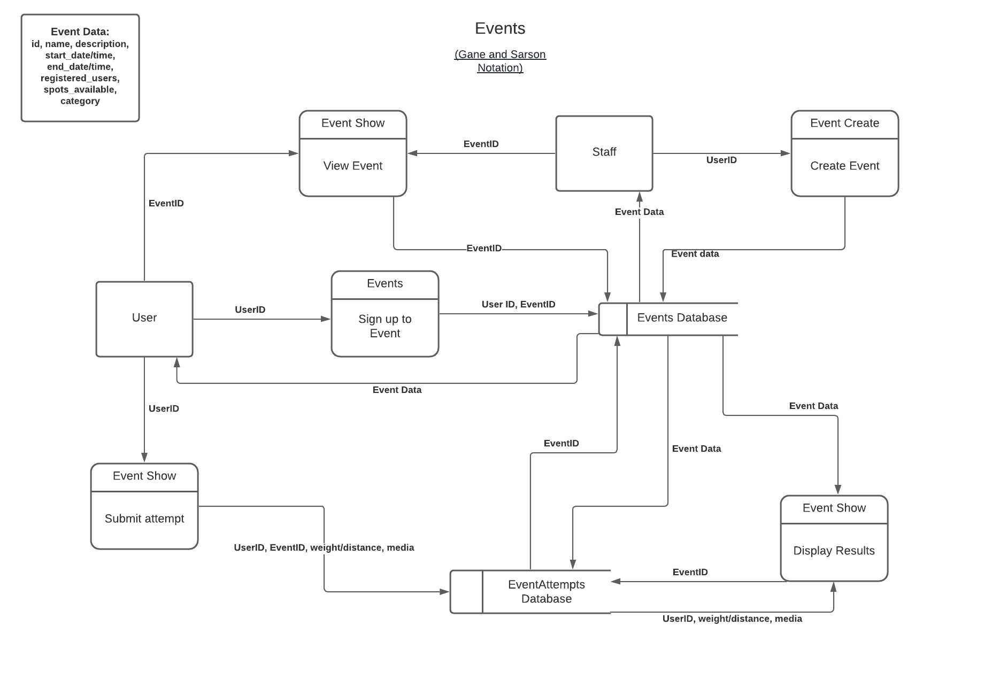

# react-gym-app

By June D, Daniel W, Nam N and Clare O

---

## About this Application

#### 1. Purpose

This application was created with the purpose to solve the problem posed by our client gym company, who wishes to have a platform where both gym members and staff can manage idividual workouts, classes and gym environment. It is a helper tool for the gym that can be used on top of their original management system that enhances the cutomer experience at their facility. Gym members can utilise this application to save and create their workout routines, keep track of their progress with certain exercises and book training sessions that are available at the gym. The application can further be used to optimise the gym's customer service by allowing users to submit reports in which staff members can smoothly handle. 

The application also aims to enhances staff work efficiency by creating a platform where their schedules including upcoming personal training and classes are neatly organised.

With the use of this application, client should expect smoother work flow of the gym where gym users get to have a more personalised and efficient workouts while requiring less direct assiatance from staff member. This therefore creates a potential for the client to see a reduction in business management cost due to increased roster efficiency.

#### 2. Functionality and Features

**(1) General features**
- Authentication
- Authorization
- Account settings 
  * a) View account information 
  * b)Forget/reset password

**(2) Managing workouts**

- create personalised workouts 
- add exercises that exist in the database or create your own exercise to add to the workout. 
- for each exercise users can set the number of reps, sets and weights (note 2)
- weights are auto in/decremented depending on whether the user has successfully completed their exercise

 Users(customers)

- exercises created by user (non-staff member) are not shared publicly. 

Staff

- staff members can share workouts publicly where users can see

**(3) Training Classes**

Users:

- users can book Personal Training sessions through the application.
- users can view details about each staff member and choose who they wish to book a personal training session with. 
- classes held by staff members can be booked also

Staff:

- gym staff can create classes and have users book for them through the application. for this, the staff must set the max capacity for each class and provide description and time of the class
- gym staff must provide available time slots that users can book a personal training (weekly or monthly)

**(4) Reports**

Users:

- users can submit a report on faulty equipment or unsocial behaviour that they notice at the gym
- provide description and media (image or video) as an option

Staff:

- staff are notified of any new reports submitted by users 
- can change report status based on whether the issue is not yet handled, is being handled or solved

**(5) Check in**

- users can check in to the gym through the application by pressing a check in button
- based on check in data users are provided with current traffic of the gym
- auto check out after certain period of time

Staff:

- based on check in information staff can analyse gym user flow over time (e.g. we get consistently busy on monday mornings)

**(6) Events**

- event refers to small competitions/games that might be held over a period of time at the gym
- e.g.  who can lift the heaviest weight

Users:

- can view events that are being held at the gym
- can choose to participate in the event and submit a score (media as proof)
- can view scoreboards with top scores over the course of the event

Staff:

- can create events and provide event description and due date

#### 3. Target Audience
  * Client: The gym
  * User: Gym members/Gym staff

#### 4. Tech Stack
  * Front End: React.js
  * Backend: Node.js, Express.js, MongoDB
---

## Dataflow Diagram

## Application Architecture Diagram

---

## User Stories

| *As a client, I want to have all users sign up for the app so they can access the application features.*|
| ------------- |
| **1st revision**: As a client, I want to have all users sign up for the app so they can access the application features. I would like to make the sign up process easier and have them be able to create an account using their membership ID.     |
| **2nd revision**: Jason is the gym owner and as a client, that also understands the need for security and authentication, he wants members of the gym to be able to register for an account in the app using their membership ID and a temporary access code that is sent to their phone.   |
| **Feature suggestions:**  a) Account sign-in/sign up  b) User Authentication |
 

| *As a client, I want the users to check in when they enter the gym so that venue capacity can be tracked and maintained.*|
| ------------- |
| **1st revision**: Jason is the gym owner, due to covid restrictions, he wants to be able to monitor the venue capacity to better follow the social distancing rules.     |
| **Feature suggestions:** Check-in/checkout button to track visitor flows |
 

| *As a client, I want to be able to create an event/group class to motivate users to work on a certain task.*|
| ------------- |
| **1st revision**:  Jason is an ambitious gym owner, he wants his gym to gain a better reputation by building a harmonious workout environment. He wants to host/organize some entertaining group events that motivate his customer to keep doing exercises. He also needs to set a hosted event's end date so the winner of the competition can be announced.     |
| **2nd revision:** Jason is an ambitious gym owner, he wants his gym gain a better reputation by building a harmonious workout environment. He wants to host and organise entertaining group events to help motivate customers to try different exercises. He wants the competition details to be easily viewable so more members are aware of the competition, and also be able to specify the competition end date so the winner of that competition can be announced.     |
| **Addition:** Due to covid social distancing restrictions, classes have a maximum capacity. As the owner, Jason wants to be able to let members see if any class is full, and not allow members to register once the class is full. If there are any cancellations, members can register for that class if it's below capacity.   |
| **Feature suggestions:** a) CURD gym event and group classes b)Set Class Capacity |
 

| *As a user, I want to view availabilities for Personal Training with a gym staff so that I can book a session that would suit my availabilities.*|
| ------------- |
| **1st revision**: As a user, I want to be able to see details of all the various PTs and the areas each one specialises in so I can select a trainer that is best equipped to help me optimise my training regimen.    |
| **2nd revision**: Jillian is a busy business women and only has the in the morning before work to go to the gym. It would be nice to have a PT that can help optimise her training routine, but what's more important to her is that she can book a session based on a time that best aligns with her busy schedule.     |
| **Feature suggestions:** a) View personal trainer information/availability b) Book/cancel PT session |
 

| *As a gym staff, I want to introduce myself to gym members, so that I can have more clients.*|
| ------------- |
| **1st revision:** As a gym staff, I want to let the customers know my specialties and also introduce myself to the gym customers who doesn't know me, so I can keep myself in front of my target customers.    |
| **2nd revision:** Brian is a hard-working personal trainer. He understands that 50% of his income is from commission of his personal training sessions. He wants to improve the reach of marketing his services so he can have more clientele.     |
| **Feature suggestions:** a) Team page; b)Personal session booking platformn |
 

| *As a user, I want to be able to view all active events that are being held and choose to participate in one or more at a time so I can meet new people.*|
| ------------- |
| **Revision**: Vivian is a freelancer. She enjoys meeting new people and loves group exercise classes/events. She would like to actively attend the gym classes whenever she is free. It can be covenitent to have an app where she can check all the available classes and book/cancel classes in advance without going to the gym|
| **Feature suggestions:** a) Book/cancel group events/classes; b)A calender where users can view/update upcoming classes |
 

| *As a user, I want to be able to view my membership details so I know my current membership status and plan when I want to freeze/renew/upgrade them.*|
| ------------- |
| **Revision**: Vivian is a freelancer. She travels a lot, so she often needs to freeze/renew her gym membership plan based on her travel itinerary. It has been a headache for her to constantly call the gym staff and get them to check/change her membership status. |
| **Feature suggestions:** a) Membership settings |
 

| *As a user, I want to be able to report on other customer's unsocial behaviour so that gym staff can attend in a timely manner and maintain a comfortable environment.*|
| ------------- |
| **Revision:** James is an active gym member, cares about the community. There have been times where he's witnessed and experienced unsocial behaviour from other members. During staffed hours, he can report these matters to a staff member, however, he has trouble reporting these issues afterhours when there's no staff around. He wants to be able to file a report if there is any cases of unsocial behaviour. |
| **Feature suggestions:** Report unsocial customer's behaviour |
 

| *As a user, I want to be able to report on faulty or missing equipment so that the gym staff are aware of it and can deal with it in a timely manner.*|
| ------------- |
| **Revision:** James cares about the gym community, so he always let the gym staff know if there's faulty equipment. However, as he often trains afterhours, there aren't any staff around to inform them. He wants to be able to report any damaged equipment so the gym staff are aware and can repair/replace them if necessary. |
| **Feature suggestions:** Report faulty gym equipement |
 

| *As a user, I want to be able to edit the weights that have been automatically set for me where I feel it's too heavy/light for me.*|
| ------------- |
| **Revision:** James is a fitness enthusiast. He always keeps track of his workout achievements and seeks more progress. He knows how to use the gym equipment and enjoys planning his daily workout routine on his own, so he doesn't think it's necessary to pay extra for a Personal Trainer. To make the workout more efficient, he wants a helper tool that can record his customized workouts and automatically remind him to increase/decrease the weights/distance based on how he is doing. |
| **Feature suggestions:** a) View workout history; b) Auto workout mode (auto increment/decrement weights/distance based on what exercise users are doing) |
 

| *As a client, I don't want to see customers cancel their bookings at the last minute, so I can better manage gym activities.*|
| ------------- |
| **1st revision:** As a client, I want my customers give me enough notice if they want to cancel/reschedule their event/PT/classes bookings, so I can better plan the gym activities. |
| **2nd revision:** Jason is the gym manager. One of his daily work is to schedule gym events/classes. He has to make sure there are enough supporting equipements and human resource to get those events/classes run smoothly. However, there are always some customers booked the events/classes early on but they canceled it at the last minute. This causes redundant labour/equipment costs for the gym. |
| **Feature suggestions:** Class/Event Cancellation policy |
 

| *As a personal trainer, I want the users to be able to save their progress with weights/time/distance so that I can suggest the weight they should lift next time.*|
| ------------- |
| **Revision:** Mike is a personal trainer in the gym. His daily work is to help his customers to achieve their fitness goals. He has more than 4 personal tranining sessions each day. This makes it hard for him to memerize all the workout progress for each of his customers. He wants an app that can save his customers' progress with weights/time/distance, so he can suggest the weight they should lift next time. He also wants to upload a workout routine to his customers routines so that they have easy access to the workout plan themselves. |
| **Feature suggestions:** Create/view/update/delete customised workout routine |
 

| *As a gym staff, I want to introduce myself to gym members, so that I can have more clients.*|
| ------------- |
| **1st revision:** As a gym staff, I want to let the customers know my specialties and also introduce myself to the gym customers who doesn't know me, so I can keep myself in front of my target customers.  |
| **2nd revision:** Brain is a hard-working personal trainer. He understands that 50% of his income depends on the commission from his personal training sessions. He wants to expose himself to the gym customers as much as possible, so they can possibly let him be their personal trainer.  |
| **Feature suggestions:** a) Our Team page b)Personal session booking platform |
 

| *As a user, I want the workouts to be grouped by category/muscle group, so I can easily plan my workout routine.*|
| ------------- |
| **Revision:** James is a fitness enthusiast. He plans his daily workout on his own. To make the workout more efficient, James only trains one or two muscle group per day. It makes his workout plan easier to follow and track, if he is able to categorise his workout routine by muscle groups. |
| **Feature suggestions:** Categorise workouts by muscle group |
 

| *As a personal trainer, I want the users to be able to save their progress with weights/time/distance so that I can suggest the weight they should lift next time.*|
| ------------- |
| **Revision:** Mike is a personal trainer in the gym. His daily work is to help his customers to achieve their fitness goals. He has more than 4 personal tranining sessions each day. This makes it hard for him to memerize all the workout progress for each of his customers. He wants an app that can save his customers' progress with weights/time/distance, so he can suggest the weight they should lift next time. He also wants to upload a workout routine to his customers routines so that they have easy access to the workout plan themselves. |
| **Feature suggestions:** Auto-save past workouts |
 

| *As a user, I want to be able to navigate the gym app easily, so I don't waste my time finding the feature I want when I am doing exercise.*|
| ------------- |
| **1st revision:** David is running his own business. He is busy most of the day and only have free time to go to the gym at night. Most of the personal trainers are off-work, so David often spent time in the gym on his own. He wants an app that can recommend exercises for him (Ideally, the recommendations are written by professional gym trainers), so he can do workouts more efficiently. |
| **2nd revision:** David is running his own business. He is busy most of the day and only have free time to go to the gym at night. Most of the personal trainers are off-work, so David often spent time in the gym on his own. He wants an app that can recommend exercises for him (Ideally, the recommendations are written by professional gym trainers), so he can do workouts more efficiently. He also wants the app to have a clear layout, so he can navigate and use the app easily without wasting his valuable time. |
| **Feature suggestions:**  a) Dashboard listing main features b) View PT workout sets |
 

| *As a User, I want to be able to create my own workout routine so that I can remember what i need to do for the day/session*|
| ------------- |
| **1st revision:** Irene is an office lady. She goes to the gym from time to time.  She would like to be able to create her own workout routine in advance, so she can remember what she needs to do for her workout day.|
| **Feature suggestions:**  CRUD customised workout routine |
 

| *As a client, I want the weights/distances to auto decrement/increment based on how my customers are doing, so that they don't get injured.*|
| ------------- |
| **1st revision:** Jason is the gym owner. He cares about his customers and doesn't want to see any of his customers get injured during the workout. He would like to have an app that can automatically remind his customers to decrease the weights.|
| **Feature suggestions:**  Auto workout mode (auto increment/decrement weights/distance  |
 

| *As a user, I want to see my workout statistics, so I can know how far away from my fitness goal.*|
| ------------- |
| ****1st revision:** James is a fitness enthusiast. To achieve his fitness goals, he visits the gym very often. Instead of manually recording all his workouts on his notebook,  he needs a tool that collects all his workout statistics and generates a workout chart, so he can know how far away he is from his fitness goal.|
| **Feature suggestions:**  Workout charts |

---

## Wireframes

---

## Project Management using Trello
